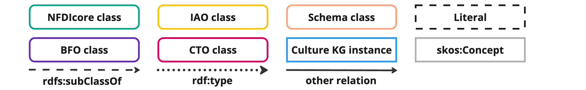
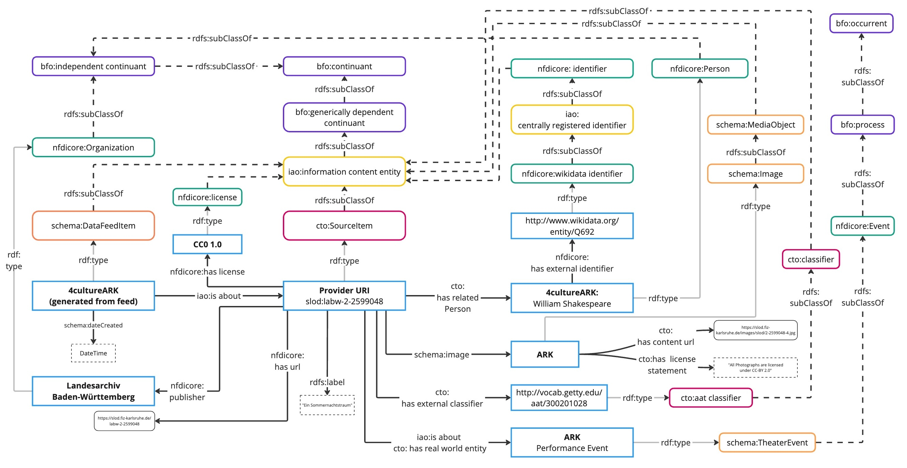
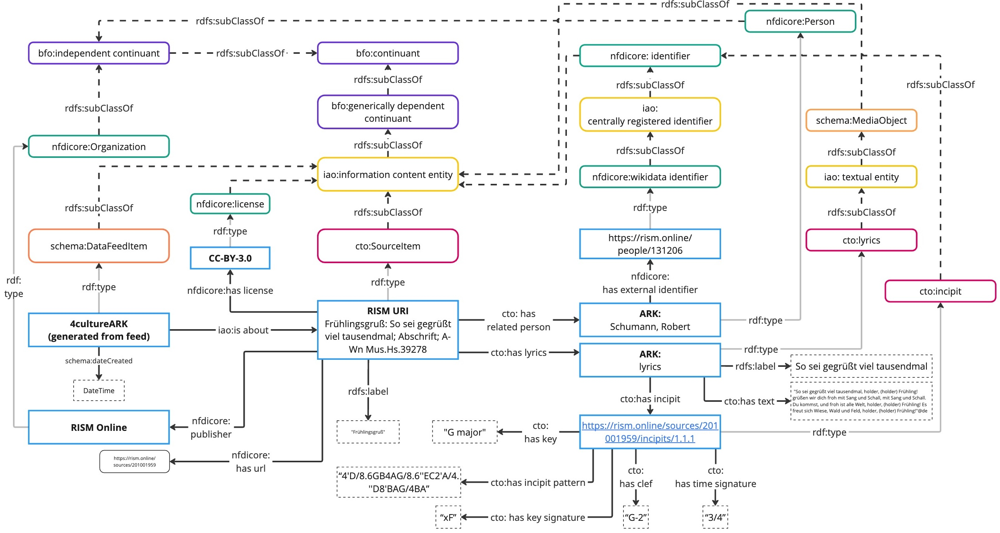

# Domain Examples
The following modeling examples illustrate how research data can be represented using the CTO, with respect to the subject areas of performing arts, musicology, media studies, art history, and architecture. They also demonstrate the alignment of CTO with NFDIcore and the Basic Formal Ontology (BFO 2020).

## Legend 

## The Performing Arts

## Musicology

