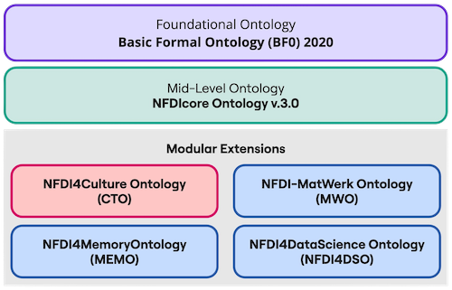

# CTO in the Context of NFDI

[NFDI4Culture](https://nfdi4culture.de/) is the Consortium for Research Data on Material and Immaterial Cultural Heritage. As a consortium within the framework of the German national research data infrastructure programme [NFDI](https://www.nfdi.de) the goal of NFDI4Culture is the establishment of a information infrastructure for cultural heritage research data. This primarily concerns the subject areas architecture, art history, performing arts, musicology, and media sciences. 

Within NFDI4Culture, a [Knowledge Graph](https://nfdi4culture.de/resources/knowledge-graph.html) has been developed and integrated with the [Culture Information Portal](https://nfdi4culture.de/) with the goal to aggregate heterogeneous and isolated data from the research landscape focused on by NFDI4Culture and thereby increase the discoverability, interoperability and reusability of cultural heritage data. The NFDI4Culture Knowledge Graph acts as a single point of access to decentralized cultural heritage research resources. 

The NFDI4Culture Ontology (CTO) is a domain ontology developed within the Task Area 5 of the NFDI4Culture initiative. Its key objective is to facilitate the integration of cultural heritage research data into the NFDI4Culture Knowledge Graph, which is made available by means of the Culture Information Portal. 

## Modular Design Approach

NFDI consortia share overarching goals and concepts, including similarities in structure, governance, personnel and institutions, areas of expertise, services, and more. At the same time, each consortium also faces individual requirements and challenges, such as domain-specific standards, workflows, and methods for research data discovery. To facilitate the interoperability of research (meta)data both within and across consortia, and to enable cross-domain knowledge discovery while also addressing the specific needs of individual communities, a modular ontology design structure has been developed.

NFDIcore has been created as a mid-level ontology representing the overarching concepts of the NFDI community. This includes community structures, such as people, projects, and organizations, as well as the NFDI infrastructure, including services, software, APIs, guidelines, educational resources, and more. NFDIcore is compliant with the Basic Formal Ontology (BFO 2020). Consortium-specific NFDI modules capture tailored information and research data. CTO is a domain-specific extension that models the research data of the NFDI4Culture community.

Next to CTO, further NFDI domain extensions are available below. Next to the listed ontolgies that are released and integrated in productive systems, further are currently under development.   

- [NFDI-MatWerk (MWO)](http://purls.helmholtz-metadaten.de/mwo/) (Material Science Domain) 
- [NFDI4Memory (MEMO)](https://github.com/ISE-FIZKarlsruhe/nfdi4memory) (Historical Domain)
- [NFDI4DataScience (NFDI4DSO)](https://nfdi.fiz-karlsruhe.de/nfdi4dso/) (Data Science Domain), for further information see also the [EKAW 2024 Paper](https://arxiv.org/abs/2408.08698 )

<!--Information Graph
#The Information Graph (IG) contains the general information about the consortium, based on the [LOD extension](https://github.com/digicademy/lod) for TYPO3 developed by the [Digital Academy in Mainz](https://www.adwmainz.de/digitalitaet/digitale-akademie.html).
#Research Data Graph
#The Research Data Graph (RDG) is the bulk research data as contributed by the [various datafeeds](https://nfdi4culture.de/go/sparql-data-portals) from the consortium participants that functions as an index of culture research data. -->