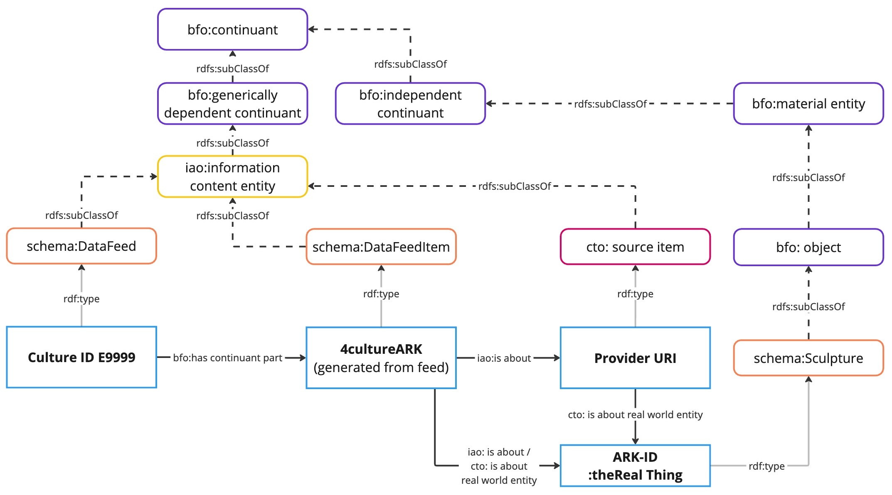

# Ontology Scope and Structure

 **The main scope of CTO** is the representation of cultural heritage research data within a data index, i.e. a single point of access to decentralized cultural heritage research resources. The ontology supports the integration of research (meta)data harvested through a dedicated ETL pipeline. Its main focus is the creation of a lightweight index of cultural heritage research data provided by the culture community, including but not limited to the subject areas of musicology, performing arts, media studies, architecture, and art history.

The key aspects of CTO concern:

- **The consortium and its infrastructure:** persons and organizations involved in research processes, services, guidelines, standards, and events
- **The content of cultural heritage research data:** cultural heritage objects, persons, locations and events referenced in the provided data, associated media, references to external vocabularies used for the identification and classification of the provided research data
- **Access and reuse:** legal statements, contact persons, standards, and export formats 

## Reused Ontologies

Building CTO based on standardized upper-level ontologies provides a well-defined and standardized semantic structure, ensuring clear definitions of entities and their relationships. These ontologies enhance interoperability across different domains, support ontology development, and promote consistency in knowledge representation. The following ontologies have been reused in CTO:

- **Basic Formal Ontology (BFO 2020):** BFO was selected as the top-level ontology due to its well-structured design, broad applicability, and ability to integrate with various ontologies. As a foundational framework, BFO provides abstract, cross-domain semantic structures, ensuring comprehensive integration and compliance with top-level ontology standards. Its adherence to the ISO/IEC 21838-2 standars further enhances interoperability in developed ontologies, facilitating knowledge representation, data exchange, and interdisciplinary collaboration.
- **NFDIcore ontology v3.0:**: As a mid-level ontology, NFDIcore plays a central role in structuring and integrating research data across consortia. NFDIcore features a modular structure for improved interoperability among NFDI consortia. It provides a shared vocabulary that represents both the organizational structure of the NFDI and the diverse datasets contributed by project partners. The ontology encompasses key concepts such as organizations, consortia, projects, datasets, research outputs, geographical locations, and technical standards. These structured representations enable efficient data management, integration, and reuse across disciplines. 
- **Information Artefact Ontology (IAO):** The Information Artefact Ontology was partially reused. The most central IAO class supporting CTO’s alignment with BFO is `iao:information content entity`. Since IAO does not yet fully support BFO 2020, certain relevant concepts could not be reused directly. In these cases, NFDIcore-specific classes—such as `dataset`, `document`, and `identifier`—were introduced to fill the gaps.
- **Schema.org:** In CTO, schema.org was particularly used for describing creative works and to ensure the alignment with the Culture Information Portal’s existing data model. 
- Further reused ontologies and vocabularies include the Software Ontology (SWO), Data Catalog Vocabulary (DCAT), and skos.

## Core Structure

The core structure of CTO consists of four main elements. `schema:DataFeed` represents a data feed in the Research Information Graph (RIG). This data feed is created in the Culture Information Portal using TYPO3 and its LOD extension. The metadata associated with the data feed include contact persons, export formats, licenses, and related projects and organizations. For each item (`cto: source item`) in the data feed, a permanent ARK (`schema:DataFeedItem`) is created as its stable reference entity. The `schema:DataFeedItem` does not contain content-related information about the source item, aside from a license issued by NFDI4Culture and the creation and modification dates. This stable reference entity functions as a persistent identifier in the knowledge graph, remaining valid even if the content of the source item is changed or deleted. The main content-related metadata are associated with `cto: source item`. This includes associated media, related entities and their identifiers in external vocabularies, temporal data, and subject-area-specific metadata, such as musical incipits. Furthermore, it is possible to express which real-world entity `cto: source item` is about. These entities could be sculptures, buildings, persons, books, etc. However, since this information is often not provided in the research data, this aspect currently serves as a proof of concept and is only materialized when clearly stated by the data providers.

